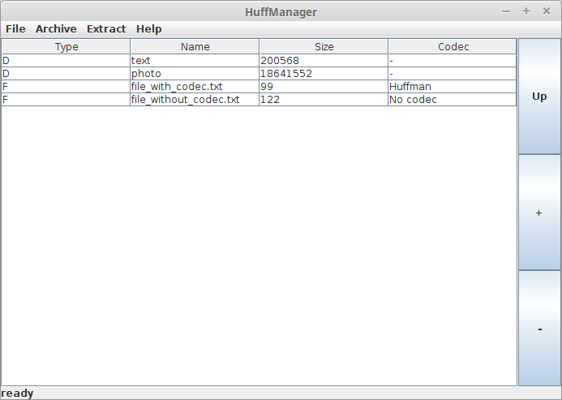

HuffManager
===========
HuffManager is Java application that can make archive (of its own binary format) containing several files. These files can also be compressed. Huffman coding is implemented in this application, however the application should be easily extensible to support other compression methods.

Requirements
-------------------
At least Java 8 is required to run this program.

Building
-----------
To build the application use the **ant** build tool. Supported ant targets are these:

* **build** - builds the application
* **run** - runs the application
* **clean** - removes generated files
* **generate-javadoc** - generates *javadoc* documentation
